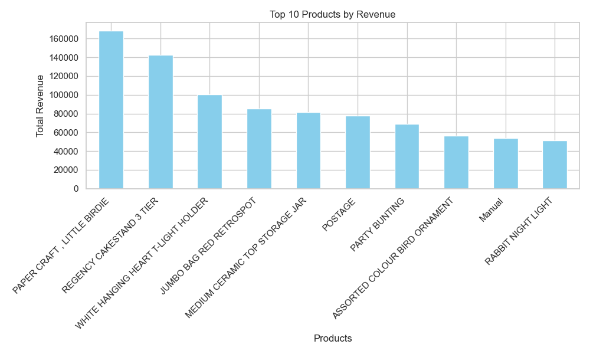

# E-Commerce Customer Behavior Analysis with Pandas

This project uses real-world retail transaction data to analyze customer behavior, product performance, and revenue trends using Python and Pandas.

## 🎯 Project Objectives

- Clean and prepare raw e-commerce data
- Analyze top products, revenue patterns, and customer behavior
- Visualize key insights using charts
- Prepare the project for presentation or portfolio use

## 📁 Project Structure

ecommerce-pandas-project/
│
├── data/ # Raw data (Excel)
├── notebooks/ # Jupyter notebooks for each stage
├── outputs/
│ ├── cleaned_data.csv # Cleaned and processed data
│ └── visuals/ # PNG charts and plots
├── requirements.txt # Python dependencies
└── README.md # Project overview


## 🛠 Tools Used

- Python
- Pandas
- Matplotlib
- Seaborn
- Jupyter Notebook

## 📊 Key Insights So Far

### 🔹 Top 10 Products by Revenue

The following chart shows which products generate the most revenue:



- These products can be prioritized for promotions or bundled offers
- Majority of revenue comes from repeat purchases of popular items

## ▶️ How to Run

1. Clone this repository:
   ```bash
   git clone https://github.com/yourusername/ecommerce-pandas-project.git
   cd ecommerce-pandas-project

2. (Optional) Create and activate a virtual environment:
    python -m venv venv
    source venv/bin/activate  # On Windows: venv\Scripts\activate

3. Install the required packages:
    pip install -r requirements.txt

4. Launch Jupyter Notebook and run:
    
    notebooks/data_cleaning_01.ipynb
    notebooks/eda.ipynb

